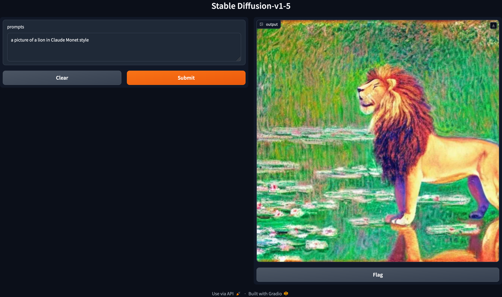

# Generating Image by Text Prompts using SD

## Introduction

We implement a (simple) module that generates images based on the user-defined (text) prompts. While preparing the module, we utilized the pretrained model Stable Diffusion-v1-5 provided by [runwayml in HuggingFace](https://huggingface.co/runwayml/stable-diffusion-v1-5).

## Setting Up the Environment

1. Install [Conda](https://conda.io/projects/conda/en/latest/user-guide/install/index.html), if not already installed.
2. Clone the repository
    ~~~
    git clone https://github.com/byrkbrk/generating-via-prompt-sd.git
    ~~~
3. Change the directory:
    ~~~
    cd generating-via-prompt-sd
    ~~~
4. For macos, run:
    ~~~
    conda env create -f generating-via-prompt_macos.yaml
    ~~~
    For linux or windows, run:
    ~~~
    conda env create -f generating-via-prompt_linux.yaml
    ~~~
5. Activate the environment:
    ~~~
    conda activate generating-via-prompt-sd
    ~~~

## Generating Images

Check it out how to use:

~~~
python3 generate.py -h
~~~

Output:

~~~
Generate image by text prompts using Stable Diffusion

positional arguments:
  text_prompts          Text prompts for image generation

options:
  -h, --help            show this help message and exit
  --scheduler_name SCHEDULER_NAME
                        Scheduler name that be used during inference. Default:
                        'pndm'
  --device DEVICE       Name of the device that be used during inference.
                        Default: None
~~~

### Example usage

~~~
python3 generate.py\
 "an image of turtle in Picasso style"\
 "an image of turtle in Camille Pissarro style"
~~~

The output images seen below (left: Picasso style, right: Pissarro style) will be saved into `generated-images` folder.

  
  

## Generating via Gradio

To run the gradio app on your local computer, execute

~~~
python3 app.py
~~~
Then, visit the url [http://127.0.0.1:7860](http://127.0.0.1:7860) to open the interface.

### Example usage

See the display below for an example usage of the module via Gradio for the prompt `'a picture of a lion in Claude Monet style'`.

  

